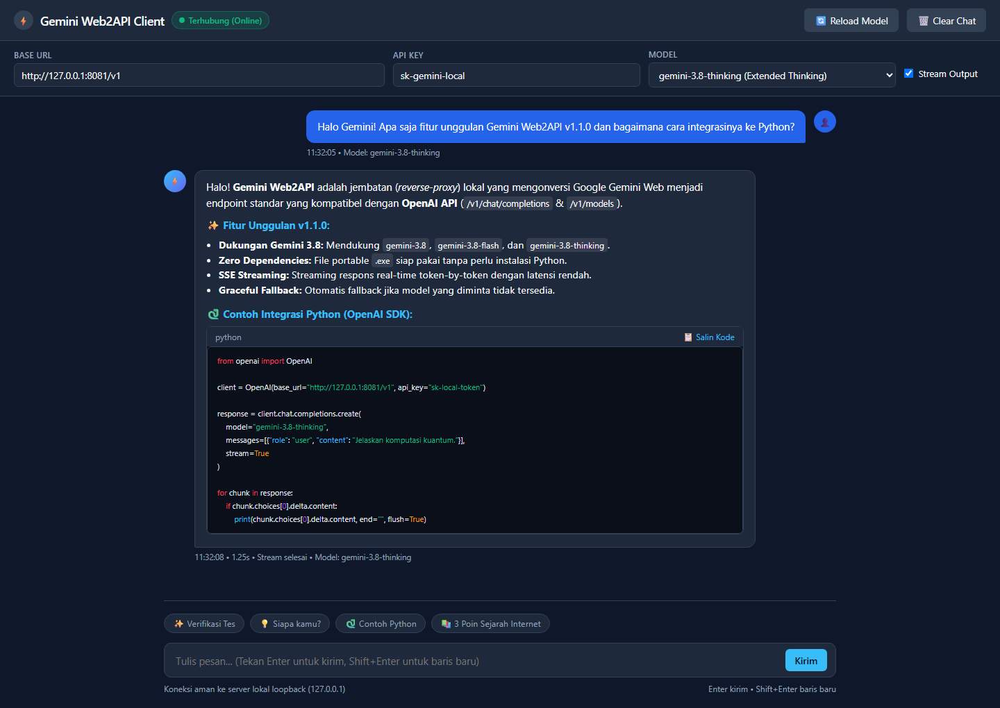

# gemini-web-to-api

<p align="center">
  
</p>

<p align="center">
  <b>Convert Google Gemini Web into a local OpenAI-compatible API for free, fast, and standalone.</b>
</p>

<p align="center">
  <a href="https://github.com/xyvren/gemini-web-to-api"></a>
  <a href="https://github.com/xyvren/gemini-web-to-api/releases"></a>
  <a href="LICENSE"></a>
  <a href="https://www.python.org/"></a>
</p>

<p align="center">
  <a href="README.md">Bahasa Indonesia</a> •
  <a href="README_CN.md">中文文档</a>
</p>

<p align="center">
  
</p>

---

Convert Google Gemini's web interface into an OpenAI-compatible API. Zero cost, cross-platform, single file or portable Windows binary.

## Features

- **Optional API Keys**: no auth when `api_keys` is empty, OpenAI-style Bearer auth when configured
- **OpenAI Compatible**: Drop-in replacement for `/v1/chat/completions` and `/v1/models`
- **Latest Gemini Models**: Supports Gemini 3.8 series (`gemini-3.8`, `gemini-3.8-flash`, `gemini-3.8-thinking`), 3.7, and 3.6
- **Built-in Web Test Client**: Lightweight web UI (`test-chat.html`) to test models, chat streaming, and prompt suggestions
- **Standalone Portable EXE**: Ready-to-use Windows `.exe` without needing Python installed
- **Graceful Model Fallback**: Automatically falls back to active default model if an unknown model ID is requested
- **Tool Calling**: Full function calling support (OpenAI format)
- **Thinking Depth**: Adjustable via `@think=N` suffix (0=deepest, 4=shallowest)
- **Web Search**: Built-in internet access (Gemini's native search)
- **Cross-Platform**: Pure Python, single optional dependency (`httpx` for streaming)
- **Streaming**: SSE streaming support via `httpx`
- **Codex CLI**: Responses API (`/v1/responses`) for OpenAI Codex integration
- **Gemini CLI**: Google native API (`/v1beta/models`) for Gemini CLI compatibility

## Quick Start

### Option 1: Windows Portable Standalone (.exe)
No Python installation required:
1. Download `gemini-web-to-api-v1.1.0-windows-x64-portable.zip` from [Releases](https://github.com/xyvren/gemini-web-to-api/releases).
2. Extract and run `start-portable.bat` or `gemini-web-to-api-portable.exe`.
3. The server starts and automatically opens the test Web UI at `http://127.0.0.1:8081/`.

### Option 2: Run with Python / CLI

```bash
git clone https://github.com/xyvren/gemini-web-to-api.git
cd gemini-web-to-api
pip install httpx
python gemini_web2api.py
```

Server starts at `http://127.0.0.1:8081/v1` and Web UI at `http://127.0.0.1:8081/`.

## Client Configuration

### Cherry Studio / ChatBox / any OpenAI client

| Field | Value |
|-------|-------|
| Base URL | `http://localhost:8081/v1` |
| API Key | any `api_keys` value from `config.json`; anything if not configured |
| Model | `gemini-3.5-flash-thinking` |

### curl

#### bash / macOS / Linux

```bash
curl http://localhost:8081/v1/chat/completions \
  -H "Content-Type: application/json" \
  -H "Authorization: Bearer sk-your-key" \
  -d '{"model":"gemini-3.5-flash","messages":[{"role":"user","content":"Hello!"}]}'
```

#### PowerShell (Windows)

```powershell
curl.exe --% http://127.0.0.1:8081/v1/chat/completions -H "Content-Type: application/json" -H "Authorization: Bearer sk-your-key" -d "{\"model\":\"gemini-3.5-flash\",\"messages\":[{\"role\":\"user\",\"content\":\"Hello!\"}]}"
```

> Note: On Windows PowerShell, use `curl.exe` and `--%` so PowerShell does not reinterpret JSON quoting or curl options.

### OpenAI Python SDK

```python
from openai import OpenAI
client = OpenAI(base_url="http://localhost:8081/v1", api_key="sk-your-key")
resp = client.chat.completions.create(
    model="gemini-3.5-flash-thinking",
    messages=[{"role": "user", "content": "Explain quantum computing"}]
)
print(resp.choices[0].message.content)
```

### Gemini CLI

```bash
export GEMINI_API_KEY=none
export GOOGLE_GEMINI_BASE_URL=http://localhost:8081
gemini
```

Supports Google native API endpoints:
- `GET /v1beta/models` — list models
- `POST /v1beta/models/{model}:generateContent` — non-streaming
- `POST /v1beta/models/{model}:streamGenerateContent` — streaming (SSE)

## Available Models

| Model | Description | Output |
|---|---|---|
| **`gemini-3.8`** | Gemini 3.8 general model (*Fast mode*) | ~12k chars |
| **`gemini-3.8-flash`** | High-speed Gemini 3.8 Flash | ~12k chars |
| **`gemini-3.8-thinking`** | Deep reasoning (*Extended Thinking*) | **~20k chars** |
| **`gemini-3.7-flash`** | Generation 3.7 Flash model | ~12k chars |
| **`gemini-3.6-flash`** | Stable default model (*recommended fallback*) | ~12k chars |
| **`gemini-3.5-flash-thinking`** | Extended thinking generation 3.5 | **~20k chars** |
| **`gemini-3.5-flash-thinking-lite`** | Adaptive thinking depth | ~15k chars |
| **`gemini-flash-lite`** | Fastest answers, lightweight | ~10k chars |
| **`gemini-auto`** | Auto model selection | varies |
| **`gemini-3.1-pro`** | Advanced math & code (*needs Gemini Advanced cookie*) | ~12k chars |

### Thinking Depth

Append `@think=N` to any model name:

```
gemini-3.8-thinking@think=0   # deepest (default)
gemini-3.8-thinking@think=2   # medium
gemini-3.8-thinking@think=4   # shallowest
```

## Optional: Cookie for Pro

Anonymous access works for all models, but `gemini-3.1-pro` routes to Flash without authentication. To get real Pro routing, you need a **Gemini Advanced (paid subscription)** account cookie:

```bash
python gemini_web2api.py --cookie-file cookie.txt
```

### How to get cookies

1. Open Chrome, go to [gemini.google.com](https://gemini.google.com) and sign in with a **Gemini Advanced** Google account
2. Open DevTools (F12) → Application → Cookies → `https://gemini.google.com`
3. Copy these cookie values: `SID`, `HSID`, `SSID`, `APISID`, `SAPISID`, `__Secure-1PSID`
4. Create `cookie.txt` in this format:

```
SID=your_sid_value; HSID=your_hsid_value; SSID=your_ssid_value; APISID=your_apisid_value; SAPISID=your_sapisid_value; __Secure-1PSID=your_1psid_value
```

Or use the JSON format:
```json
{"cookie": "SID=xxx; HSID=xxx; SSID=xxx; APISID=xxx; SAPISID=xxx; __Secure-1PSID=xxx", "sapisid": "your_sapisid_value"}
```

**Alternative (browser extension)**: Use any "Export Cookies" extension to export cookies for `gemini.google.com` in Netscape format, then convert to the single-line format above.

### Authenticated account path and XSRF token

If the signed-in Gemini page URL contains an account index, such as:

```
https://gemini.google.com/u/1/app/...
```

set `auth_user` to that index. Authenticated web requests may also require the page XSRF token. In the rendered Gemini page source, this token is exposed as `SNlM0e`; pass it as `xsrf_token` in `config.json`. The server sends it as the `at` form field.

Example:

```json
{
  "cookie_file": "/app/cookie.txt",
  "auth_user": "1",
  "xsrf_token": "AOOh0P...",
  "gemini_bl": "boq_assistant-bard-web-server_YYYYMMDD.xx_p0"
}
```

If authenticated requests return HTTP 400 with an `xsrf` error, refresh Gemini Web, update `xsrf_token`, and make sure `auth_user` matches the `/u/<index>/` part of the browser URL.

Pro routing requires **Gemini Advanced** (paid subscription). A free Google account cookie will authenticate but silently fall back to Flash.

## Configuration

Create `config.json` in the same directory:

```json
{
  "port": 8081,
  "host": "0.0.0.0",
  "retry_attempts": 3,
  "retry_delay_sec": 2,
  "request_timeout_sec": 180,
  "gemini_bl": "boq_assistant-bard-web-server_20260716.08_p0",
  "auth_user": null,
  "xsrf_token": null,
  "api_keys": ["sk-your-key"],
  "cookie_file": null,
  "proxy": null,
  "log_requests": true,
  "temporary_chats": false
}
```

Set `temporary_chats` to `true` to use Gemini Web temporary chats instead of
persisting conversations to the account history.

When `api_keys` is `[]`, authentication is disabled. When one or more keys are set, `/v1/*` endpoints require `Authorization: Bearer <key>` or `x-api-key: <key>`.

## Docker

```bash
cp config.example.json config.json
docker build -t gemini-web-to-api .
docker run -d --name gemini-web-to-api -p 8081:8081 -v ./config.json:/app/config.json gemini-web-to-api
```

Or use Docker Compose:

```bash
docker compose -f docker-compose.local.yml up -d
```

To mount a cookie file:

```bash
docker run -d --name gemini-web-to-api -p 8081:8081 -v ./config.json:/app/config.json -v ./cookie.txt:/app/cookie.txt gemini-web-to-api
```

Set `"cookie_file": "/app/cookie.txt"` in `config.json`.

> **Note**: If you get empty responses (`content: null`) with Docker's default bridge network, switch to host networking: `docker run --network host ...` or add `network_mode: host` in your compose file. This is caused by Gemini's upstream rejecting requests from certain Docker NAT IP ranges.

## Proxy

If you cannot access `gemini.google.com` directly (connection timeout), configure a proxy:

**Method 1: CLI argument**
```bash
python gemini_web2api.py --proxy http://127.0.0.1:7890
```

**Method 2: config.json**
```json
{"proxy": "http://127.0.0.1:7890"}
```

**Method 3: Environment variable** (auto-detected)
```bash
export HTTPS_PROXY=http://127.0.0.1:7890
python gemini_web2api.py
```

Works with Clash, V2Ray, Shadowsocks, or any HTTP proxy.

## Tool Calling

```python
resp = client.chat.completions.create(
    model="gemini-3.5-flash",
    messages=[{"role": "user", "content": "What's the weather in Tokyo?"}],
    tools=[{
        "type": "function",
        "function": {
            "name": "get_weather",
            "description": "Get weather for a city",
            "parameters": {"type": "object", "properties": {"city": {"type": "string"}}, "required": ["city"]}
        }
    }]
)
```

## Image Input

OpenAI-style multimodal messages are supported for Chat Completions and the
Responses API. Use either HTTP(S) image URLs or base64 data URLs:

```python
resp = client.chat.completions.create(
    model="gemini-3.6-flash",
    messages=[{
        "role": "user",
        "content": [
            {"type": "text", "text": "Describe this image"},
            {"type": "image_url", "image_url": {"url": "https://example.com/image.png"}}
        ]
    }]
)
```

## Limitations

- **Image upload may require cookies**: Multimodal input uses Gemini Web's image upload endpoint. If anonymous upload fails, configure a Gemini cookie.
- **Not real Pro/Ultra**: Without a paid subscription cookie, `gemini-3.1-pro` routes to the same Flash model. The "Pro" label is a UI preference, not a backend model switch.
- **Single-turn only**: Each request is an independent conversation. Multi-turn context is simulated by including previous messages in the prompt.
- **Rate limits**: Google may throttle high-frequency requests. The server retries automatically but sustained heavy use may be blocked.

## Requirements

- Python 3.8+
- `httpx` (`pip install httpx`) — used for streaming requests
- Network access to `gemini.google.com` (proxy/VPN may be needed in some regions)

## How It Works

This tool reverse-engineers Google Gemini's web StreamGenerate protocol. It sends requests to the same endpoint that the Gemini web app uses, converting between OpenAI's API format and Gemini's internal protobuf-like format.

The model selection is controlled by field `[79]` in the request payload, mapped from Gemini's frontend JavaScript source (`MODE_CATEGORY` enum).

## Acknowledgments

- Inspired by the open-source API proxy ecosystem

## License

MIT

---

## 致谢

本项目的开发 agent 能力由 [GenericAgent](https://github.com/lsdefine/GenericAgent) 提供。

### 🚩 友情链接

[](https://github.com/lsdefine/GenericAgent)
[](https://linux.do/)
